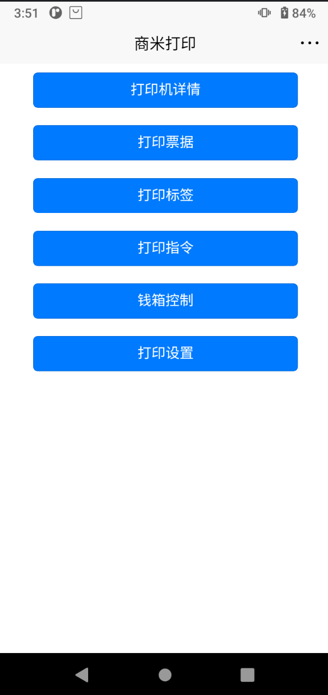

# Uniapp SDK 概览

商米推出了 Uniapp 打印机 SDK 插件，用于在 **UniApp** 及 **UniApp-x** 环境下开发针对商米 V2sPlus、V3 等 Android 设备的打印功能。第三方开发者通过调用本 SDK，可便捷使用商米设备内置打印机，轻松实现打印功能，有效提升开发效率、降低对接成本。

## 1. 如何集成 SDK

### 1.1 安装插件

在项目中通过 **uni_modules** 引入 `sunmi-printersdk` 插件（从插件市场安装或拷贝至 `uni_modules` 目录）。

### 1.2 引入模块

在页面的 `script` 中按需引入打印相关 API：

```javascript
import { PrinterSdk } from "@/uni_modules/sunmi-printersdk";
import { LineApi } from "@/uni_modules/sunmi-printersdk";
import { CanvasApi } from "@/uni_modules/sunmi-printersdk";
import { CommandApi } from "@/uni_modules/sunmi-printersdk";
```

---

## 2. 演示示例

以下为基于本 SDK 开发的 Uniapp 打印 Demo 主界面，展示了打印机详情、打印票据、打印标签、打印指令、钱箱控制、打印设置等能力入口：



---

## 3. 如何使用 SDK

### 3.1 获取打印机

使用打印能力前，需先初始化并获取打印机实例。在页面 **onLoad** 中调用 `PrinterSdk.initPrinter(callback)`，在回调中根据结果判断是否获取到默认打印机；获取成功后即可使用 LineApi、CanvasApi、CommandApi 等进行打印。

获取打印机详情（如名称、类型、纸宽、状态等）可调用：

```javascript
const info = PrinterSdk.getPrinterInfo();
// info 中包含 code、msg、id、status、name、type、paper 等字段
```

**示例：初始化打印机**

```javascript
PrinterSdk.initPrinter((success, message) => {
  if (success) {
    console.log('打印机初始化成功');
    const info = PrinterSdk.getPrinterInfo();
    console.log('打印机信息', info);
  } else {
    console.log('打印机初始化失败', message);
  }
});
```

### 3.2 设置日志输出的 API

用于开启或关闭 SDK 内部日志输出，便于调试：

```javascript
PrinterSdk.log(enable, tag);
```

| 参数     | 类型    | 说明 |
|----------|---------|------|
| enable   | boolean | 是否开启日志 |
| tag      | string  | 可选，日志标签或附加信息 |

**示例：开启日志**

```javascript
PrinterSdk.log(true, 'SunmiPrinter');
```

### 3.3 释放 SDK

在页面 **onUnload** 中调用 `PrinterSdk.destroy()`，反初始化并释放打印机相关资源，避免内存泄漏：

```javascript
onUnload() {
  PrinterSdk.destroy();
}
```

### 3.4 跳转到打印机配置页面

可调起系统打印机配置页，方便用户进行打印设置：

```javascript
PrinterSdk.startSettings(item);
```

| 参数  | 类型 | 说明 |
|-------|------|------|
| item  | SettingItem | 设置项，对应 SDK SettingItem 枚举类型 |

**返回值**：`boolean`，是否成功调起设置页。

**示例：打开主设置页**

```javascript
const opened = PrinterSdk.startSettings(SettingItem.ALL);
if (opened) {
  console.log('已打开打印设置页');
} else {
  console.log('打开设置页失败');
}
```

**补充说明**：由于部分商米打印机的全局属性只能在系统设置中配置，因此我们提供了接口方式，可以跳转到相应的配置界面。

**SettingItem 枚举**（传入 `startSettings(item)` 的 `item` 时，使用各枚举对应的值）：

| 枚举 | 描述 |
|------|------|
| TYPE | 跳转到切换打印机类型的配置项，允许用户将当前打印机切换为热敏/标签等。 |
| DENSITY | 跳转到打印机浓度配置项，供用户设置打印浓度值。 |
| PAPER | 跳转到打印机纸张规格配置项，允许用户切换当前打印机的纸张规格。 |
| FONT | 跳转到打印机字体配置项，允许用户切换当前打印机字体。 |
| ALL | 跳转到其他配置项。 |

> **版本要求**：跳转打印机配置用于商米打印机，要求打印服务版本在 **6.6.32** 以上。如果打印服务版本不支持跳转配置，则此方法返回失败。

### 3.5 SDK异常
商米打印SDK是一套针对各种类型打印机的API。不同类型的API对应不同类型的打印机调用。如果调用某些特定打印机不支持的API，可能会引发SDK异常。
例如，调用API构建激光打印机热敏收据的内容时，就会引发异常。
商米打印SDK基本适用于所有商米设备。部分机型由于系统版本过低，可能不支持API，请联系商米技术支持将设备升级到最新版本。

